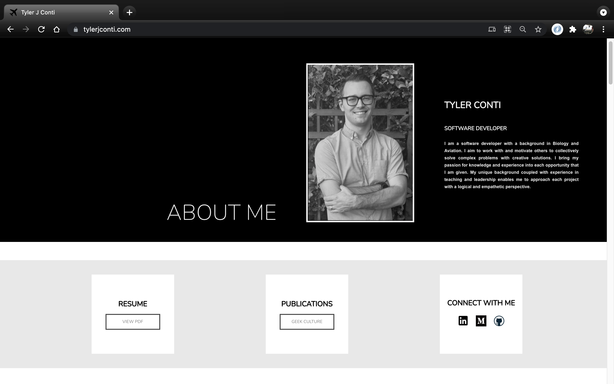
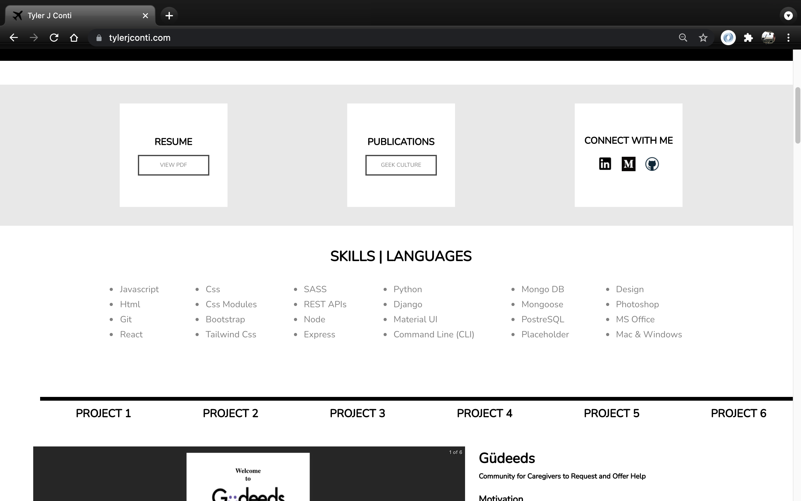
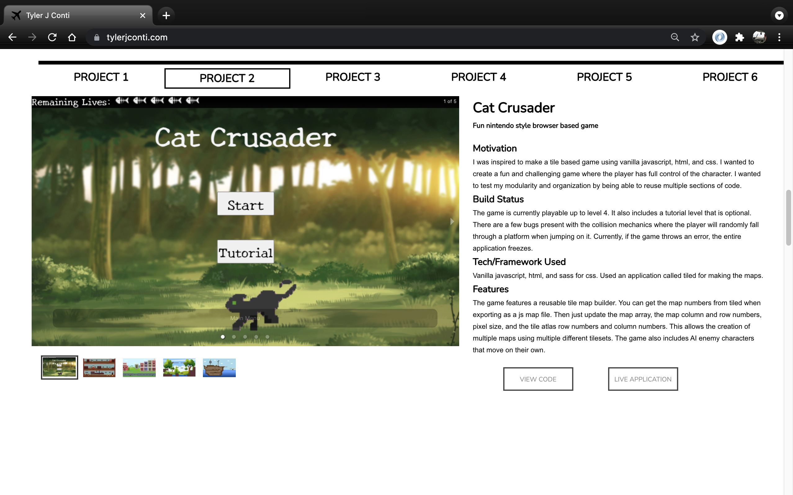

# First Portfolio
    

My first attempt at a professional portfolio site. 
Live link here https://6148daa61c206d0c55f5cda0--elated-thompson-fcaf04.netlify.app/

## Motivation
I was inspired to make a simple single page application. I used a clean and modern black and white design. All information is contained on one single page so there was no need for a router.   

   

## Build Status
The website is in its final form. Except for an occasional update as bugs are encountered, this will not be updated further.

## Tech/framework used
React, css, react-minimal-pie-chart, react-responsive-carousel, react-scroll, and uuidv4.

## Features
Features include a responsive image carousel, a navbar that autoscrolls to a selected project, responsive mobile design, and project data stored in json format.   

## License
&copy; tjconti12